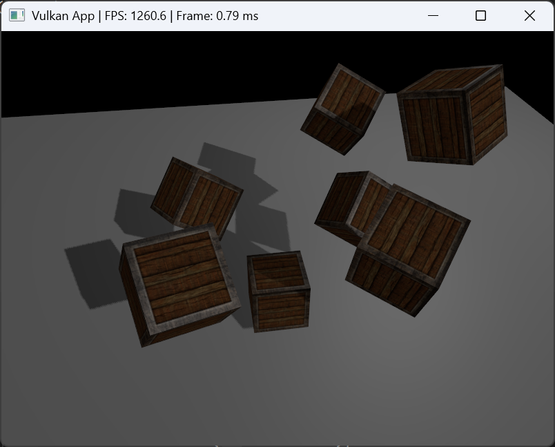
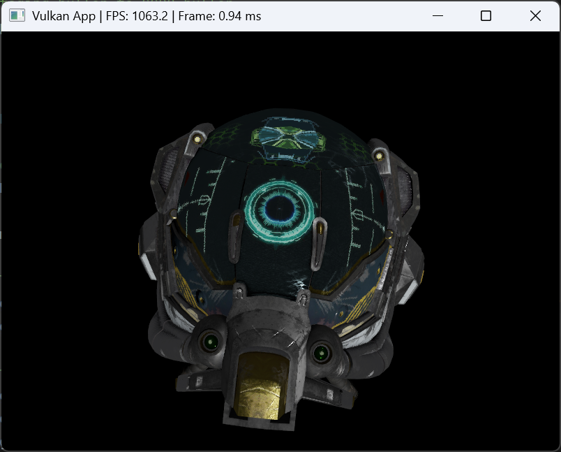

# m1VulkanEngine

This is a personal project to learn Vulkan and moder C++.

## Project Structure

```
.
├── resources/          # 3D models and textures
├── shaders/
├── src/
│   ├── geometry/       # Geometric definitions such as mesh and vertex
│   ├── graphics/       # Core rendering engine
│   │   ├── Engine.hpp  # The main class that orchestrates the rendering process.
│   │   ├── Device.hpp
│   │   ├── SwapChain.hpp
│   │   ├── Pipeline.hpp
│   │   ├── ...
│   │   └── ...
│   ├── Window.hpp      # Wrapper class for the GLFW window
│   └── main.cpp
├── CMakeLists.txt
└── README.md

```

## Current Features

*   Load and render `gltf` and `.obj` models.
*   Blinn–Phong and shadow mapping.
    
*   PBR (work in progress..)
  
    
*   Compute shader to animate a particle system.

## Notes

This project is still under development as I continue studying Vulkan.

## Credits & Resources

The following resources were used to develop this project:

* [Khronos Vulkan Tutorial](https://docs.vulkan.org/tutorial/latest/00_Introduction.html)
* [Vulkan Tutorial](https://vulkan-tutorial.com/)

